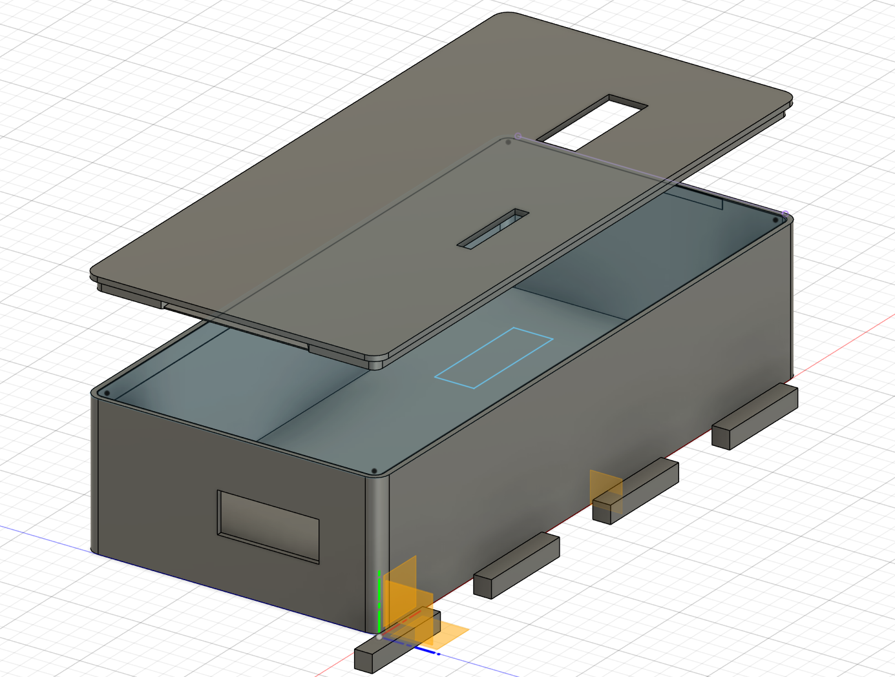

# ESP32 Simon Says Game

A classic memory game implemented on the ESP32 microcontroller platform. Test your memory by repeating increasingly complex sequences of lights and sounds!

## Hardware Requirements

- ESP32 WROOM DevKit V1 or compatible board
- 4 RGB LEDs (or separate colored LEDs)
- 4 Push buttons
- 1 Buzzer
- Resistors for LEDs
- Breadboard and jumper wires

## Pin Connections (You can change it in .h files)

### LED Connections
- Red LED: GPIO 13
- Green LED: GPIO 12
- Blue LED: GPIO 14
- Yellow LED: GPIO 27

### Button Connections
- Button 1: GPIO 25
- Button 2: GPIO 33
- Button 3: GPIO 32
- Button 4: GPIO 23

### Buzzer Connection
- Buzzer: GPIO 26

## Installation Instructions

1. Clone this repository
2. Open the project in PlatformIO
3. Configure your board in platformio.ini (default: nodemcu-32s)
4. Build and upload to your ESP32

## How to Play

1. Power on the ESP32
2. The LEDs will toggle, indicating the game is ready
3. Press any button to start
4. Watch and remember the sequence of flashing LEDs
5. Repeat the sequence by pressing the corresponding buttons
6. Each successful round adds one more step to the sequence
7. If you make a mistake, the game plays a losing sound and resets

## Code Structure

The project is organized into three main components:

### Hardware Layer
- `buttons.cpp/h`: Button initialization and input handling
- `leds.cpp/h`: LED control functions
- `buzzer.cpp/h`: Sound generation

### Game Logic
- `game.cpp/h`: Game state management, sequence generation, and gameplay logic

### Application Layer
- main.cpp: Setup and main game loop

## Features

- Dynamic sequence generation with unlimited length
- Visual feedback through LEDs
- Audio feedback through buzzer

## 3D Case for project

## License

MIT License - Feel free to modify and distribute this project.

## Credits

Created by potrec
